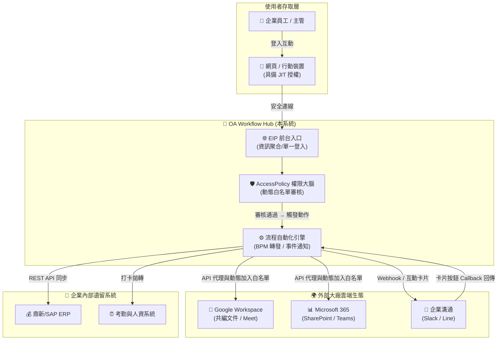
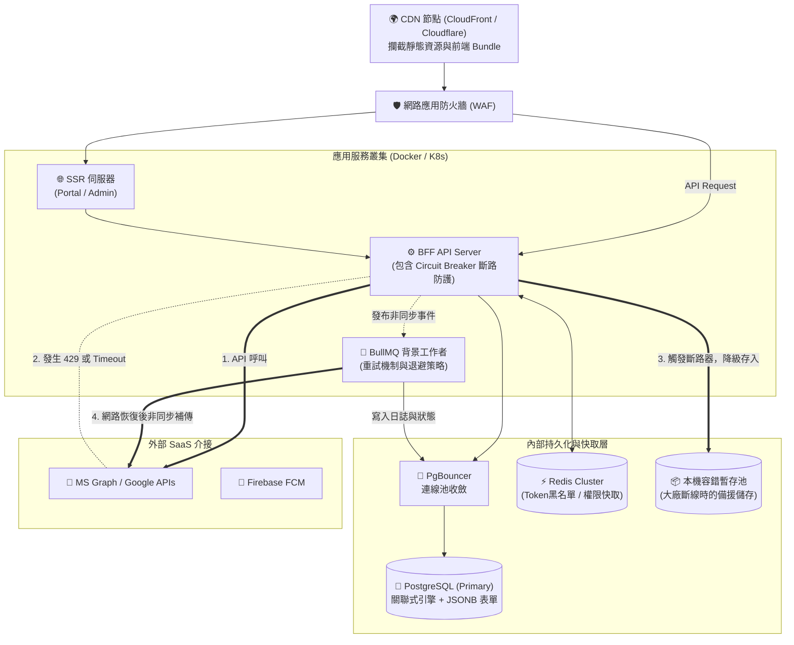
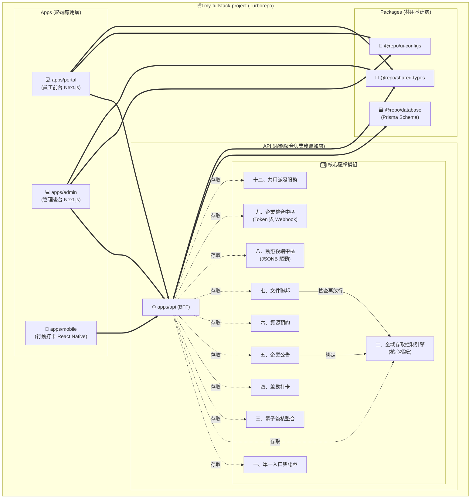

# 企業 OA 系統架構總覽 (Visual Architecture Overview)

**文件版本**：v1.0 | **編撰日期**：2026-04-13 | **核心精神**：整合大廠生態 (Hub & Spoke)、零信任控制、彈性微服務

本文件旨在透過高階圖解，向利害關係人（高階主管、架構師、開發團隊）清晰展示本系統的核心運作邊界與實體架構。

---

## 1. 服務架構 (Service Architecture)

> **設計核心**：本系統不盲目自建底層服務，而是將自身定位為 **「 Workflow Hub (流程中樞) 與權限大腦」**。我們將資料儲存、繁重即時通訊的苦差事外包給微軟 (M365) 與 Google，但牢牢握住**資料的最終控制閥 (Access Policy)**。

*   **價值體現**：當員工要開啟一份檔案，OA 大腦 (`PolicyEngine`) 攔截請求，確認其職級符號後，呼叫 Google API 將該員暫時加入檔案白名單，實現**以 OA 紀律管控外部工具**。

---

## 2. 基礎系統架構 (Infrastructure Architecture)

> **設計核心**：高度防禦性與容錯機制。為防止外部 SaaS 大廠 API 發生 Outage (服務中斷) 拖垮我們的系統，基礎架構內建了**斷路器 (Circuit Breaker)** 與**非同步備援隊列 (Fallback Retry)**。

*   **價值體現**：系統即便遭遇微軟全域大當機，員工依舊能順利打卡登入（因為身分驗證在 BFF 與緩存內），需上傳的文件會優雅降級存入 `LocalFallback` 暫存，不影響業務中斷。

---

## 3. 模組架構 (Module / Monorepo Architecture)

> **設計核心**：採用 `Turborepo` 單體化多儲存庫（Monorepo），實體拆分關注點。**所有企業獨有邏輯皆封裝於 BFF 模組中**。共有 10+ 大邏輯模組相互支撐。

*   **價值體現**：前端 (`portal` / `admin`) 是純粹的「視覺展示層」，沒有任何商業機密。所有「誰能看到什麼」、與「表單動態串接」的複雜邏輯均在 `apps/api` 的九大模組內處理，底層共用 `@repo/database` 以確保前後端的 TypeScript 型別擁有 100% 絕對的一致性（Type-Safe）。
