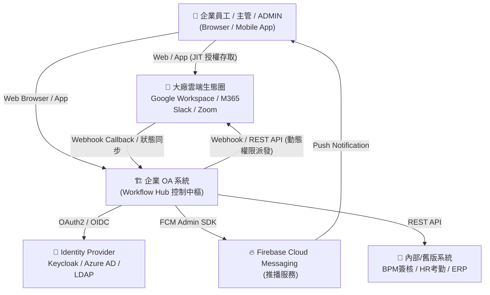
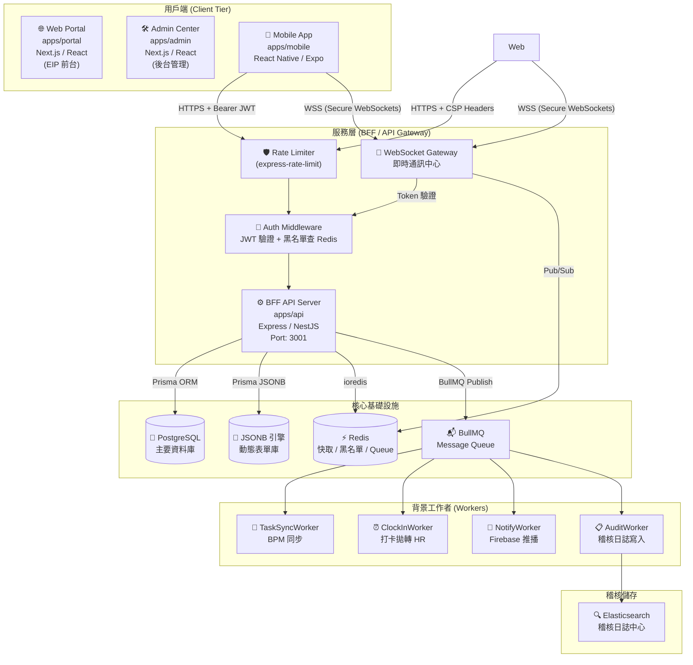
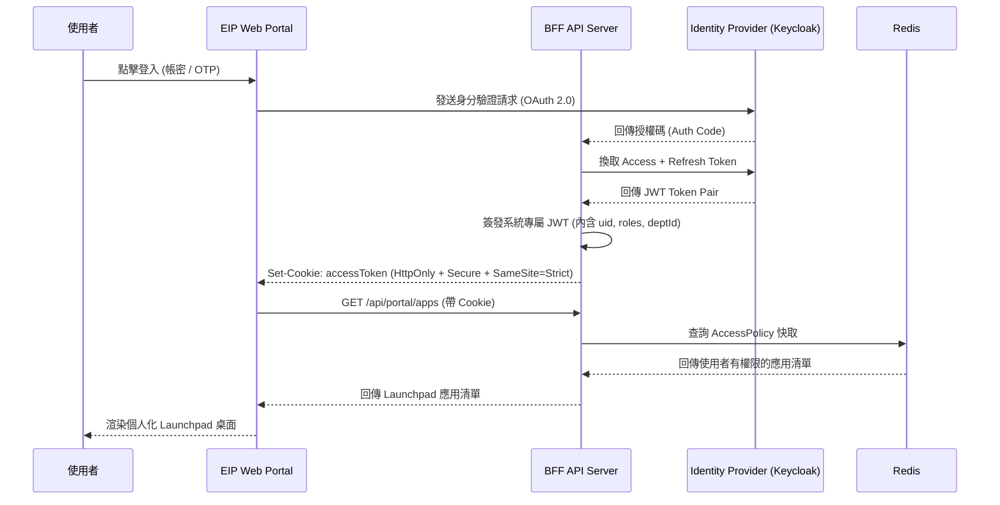
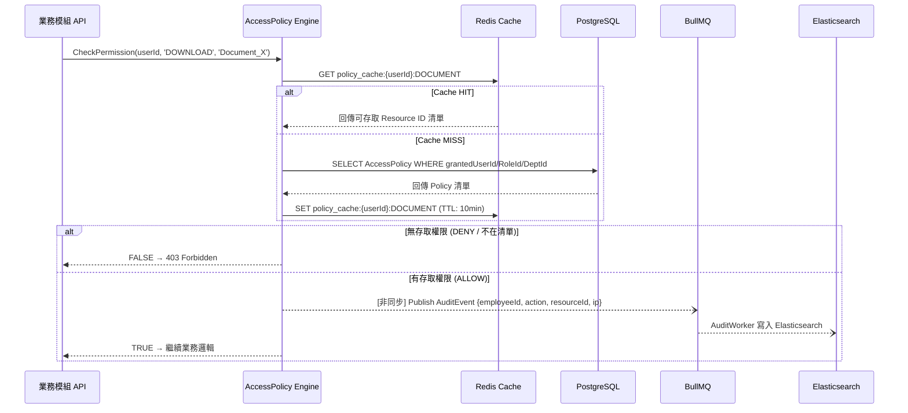
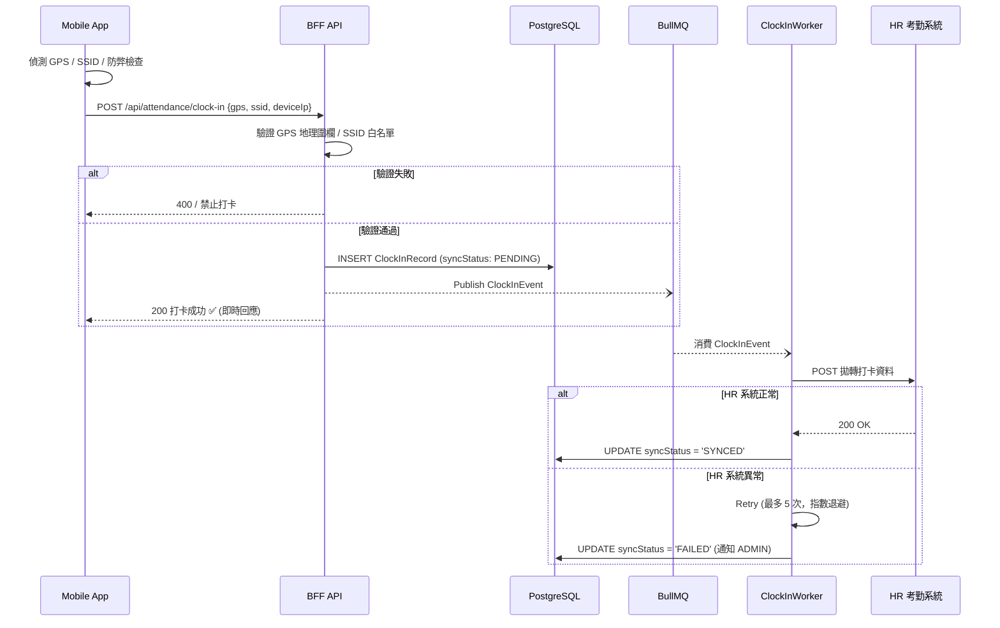
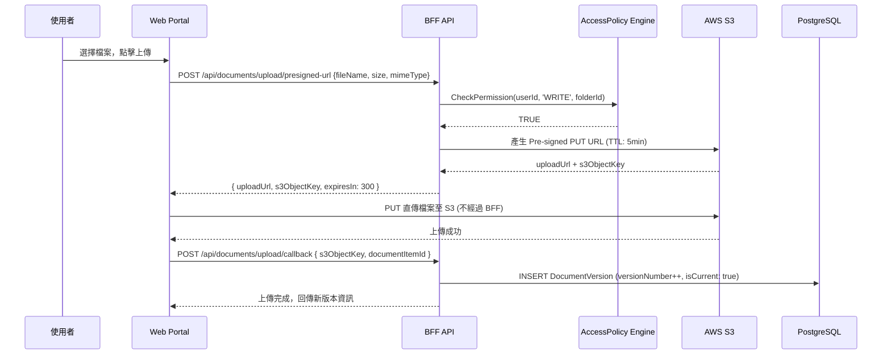
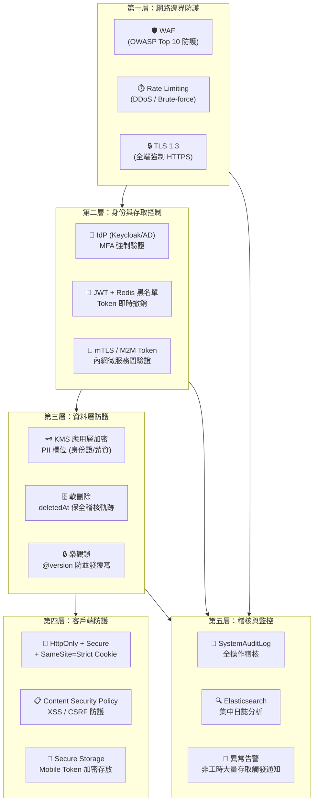
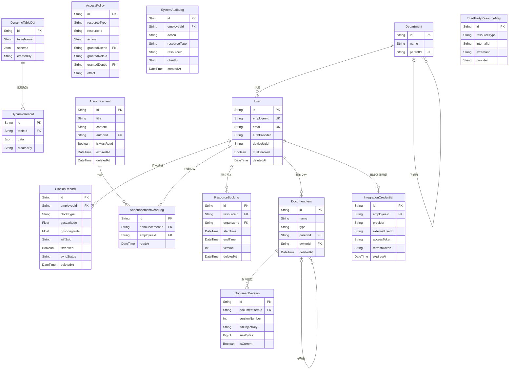
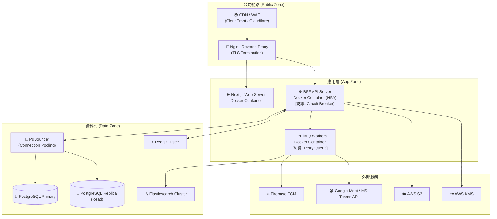

# 系統架構圖 (System Architecture Diagram)
**文件版本**：v1.2 | **日期**：2026-04-08 | **狀態**：✅ 架構師確認 / ✅ SA + SE 審核通過

---

## 一、全系統架構全覽 (C4 Level 1: System Context)

---

## 二、應用層架構圖 (C4 Level 2: Container Diagram)

---

## 三、身分認證與 SSO 流程 (Authentication Flow)

---

## 四、AccessPolicy Engine 運作流程 (權限引擎 + Redis + Audit)

---

## 五、打卡流程 (差勤 + EDA 非同步拋轉)

---

## 六、文件上傳流程 (S3 Pre-signed URL 兩段式直傳)

---

## 七、零信任安全層次架構 (Zero-Trust Security Layers)

---

## 八、資料庫 Schema 關聯圖 (ER Diagram)

---

## 九、部署架構圖 (Deployment Architecture)

---

## 十、架構師 + SA + SE 聯合審核意見

> ✅ **架構師 (Architect) 確認**：
> - 微服務邊界清晰，BFF 聚合層有效降低前端複雜度
> - AccessPolicy Engine 的橫切設計確保低耦合擴充彈性
> - EDA (事件驅動) 架構解耦了高峰打卡的同步壓力

> ✅ **SA (系統分析師) 確認**：
> - 所有功能需求已完整對映到對應模組
> - 資料模型設計符合業務邏輯，關聯完整無循環依賴
> - Non-functional requirements (效能、資安、法規) 在架構層面均有具體對應機制

> ✅ **資深 SE (軟體工程師) 確認**：
> - 技術選型成熟 (PostgreSQL + Prisma + BullMQ + Redis) 社群活躍，開發友善
> - Monorepo (Turborepo) 架構使 packages/database Schema 可跨 apps 共享，減少重複程式碼
> - ⚠️ **風險提示**：Elasticsearch 的初期維運成本較高，建議 Phase 1 先以 SystemAuditLog 在 PostgreSQL 落地，Phase 2 再引入 Elasticsearch 遷移
> - ⚠️ **風險提示**：微前端 (Webpack Module Federation) 的版本相依管理較複雜，建議待子系統穩定後再啟動此項整合
