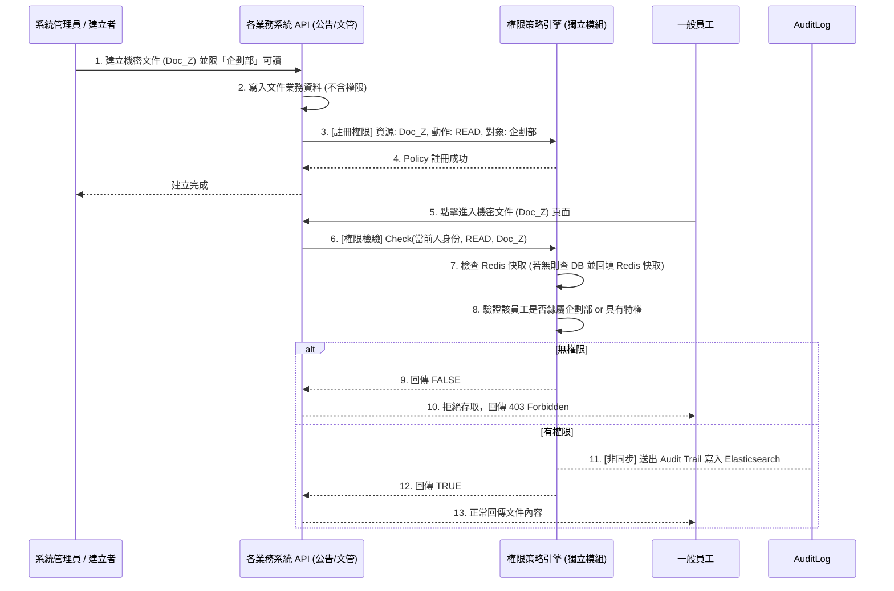

# 全域資料可見度與存取控制引擎 (Global Visibility & Access Control Engine)

因應企業內部機敏資訊與多維度權限的需求，針對「有權限看到什麼資訊 (Data Visibility)」的管控，我們將其從各個業務子系統中抽離，形成一個**獨立的「中央權限策略引擎 (Policy Engine)」模組**。

該模組的設計哲學汲取了 AWS IAM Policy 與 Casbin 驗證框架的概念，具備**與所有業務模組極低耦合、且能跨模組統一管控**的特性。

---

## 1. 運作機制 (預作機制)

### 1.1 資源抽象化 (Resource Abstraction)
所有 OA 系統內的資料紀錄（一則公告、一份文件、一個專案模組、一間會議室），在此模組中都被視為不可知的**「資源 (Resource)」**。
引擎不需要理解這份公文的具體內容，它只在乎四個維度：
**【誰 (Subject)】 在什麼【條件 (Condition)】下可以對 【哪個資源 (Resource)】 進行 【什麼操作 (Action)】。**

### 1.2 低耦合的驗證機制 (Evaluator API)
業務模組在存取資料時，本身不再負擔判斷權限的責任，而是透過以下兩種標準介面向策略引擎請求授權：
* **前置過濾 (Pre-filtering) - 用於列表查詢**：
  * **場景**：使用者打開「公司公告列表」。
  * **動作**：BFF 先向權限引擎詢問：「回傳 `User A` 具有 `READ` 權限的所有 `Announcement` 的 Resource ID 清單」。
  * **結果**：引擎回傳 ID 清單後，宣告業務 API 基於這個清單加上業務條件（如：未過期）去資料庫撈取結果。
* **即時攔截 (Post-validation) - 用於單筆操作**：
  * **場景**：`User A` 試圖下載「文管中心的文件 X」。
  * **動作**：API 直接詢問引擎：`CheckPermission(UserA, "DOWNLOAD", "Document_X")`。
  * **結果**：引擎只回傳 `TRUE` 或 `FALSE`，決定是否開放下載串流。

### 1.3 效能優化：Redis 權限快取 (N+1 防護)
由於權限檢查會在上百份清單中被高度頻繁呼叫，為了避免 N+1 查詢壓垮關聯式資料庫，引擎內部實作 **Redis 快取層**。
* 當某個使用者的 Policy 首次被解析後，將其「可存取的資源 ID 清單」快取於 Redis 中，設定 TTL（如 10 分鐘）。
* 若快取存在，引擎直接以 Redis 內容回覆 `Pre-filtering` 查詢。

### 1.4 全域稽核日誌截流器 (Centralized Audit Trail)
因為所有機敏資料（如：下載企劃書、查閱個資）的放行一定會經過 Policy Engine 回傳 `TRUE`，此模組兼具最佳的「咽喉點 (Chokepoint)」設計。
* **觸發機制**：只要引擎判斷准許存取 (`CheckPermission == TRUE`)，引擎會透過 Message Queue 非同步拋出存取紀錄。
* **儲存目標**：集中寫入至 Elasticsearch (或 Datadog 等服務)，作為日後資安稽核的依據。

---

## 2. 主要流程 (權限註冊與查詢)

### 流程圖：資源權限生命週期與驗證



---

## 3. 應用層 Model 設計 (Policy Schema)

這個獨立模組的資料表，徹底取代了原本散落在各個系統的權限關聯表（不再需要 `targetDepts` 或 `readRoles`）。

```typescript
// 1. 資源類型字典 (可供全模組通用擴充)
enum ResourceType {
  ANNOUNCEMENT
  DOCUMENT
  BPM_FORM
  MEETING_ROOM
  WIDGET          // 啟動台上的各種模組區塊也算資源
}

// 2. 核心：全域存取策略表 (Global Access Policy)
model AccessPolicy {
  id             String       @id @default(uuid())
  
  // 1. 目標資源定義 (Where)
  resourceType   ResourceType // 資源類別 (例: DOCUMENT)
  resourceId     String       // 資源 ID (例: "doc-uuid-123", 或 "*" 代表全類型)
  
  // 2. 容許的操作類型 (What)
  action         String       // 動作 (例: "READ", "WRITE", "DELETE", "DOWNLOAD")
  
  // 3. 授權的對象 Subject (Who) - 符合任一條件即命中此 Policy
  grantedUserId  String?      // 綁定特定員工 (User UUID)
  grantedRoleId  String?      // 綁定特定角色 (Role UUID，例: 最高權限管理員)
  grantedDeptId  String?      // 綁定特定部門 (Department UUID，包含其子部門)
  
  // 4. 決策行為 (Effect)
  effect         String       // "ALLOW" 或 "DENY" (Deny Override：若設為 DENY，即使符合前面的條件也強行拒絕)

  createdAt      DateTime     @default(now())
}
```

---

## 4. 低耦合架構帶來的好處

1. **業務 Model 極度純粹化**：
   公告系統不再在乎「這則公告誰能看」；文管系統不再處理「權限群組交集判斷」。各系統的 Schema 只需要專注於業務資料本身，維護成本大幅降低。
2. **多個資源的群組管控化 (Cross-Module Visibility)**：
   若公司設立臨時的「金控專案」，我們可以統一寫一條策略表單 `AccessPolicy` 將屬於該專案的公告 A、公文 B、專屬會議室 C 的資源皆設定為 `grantedRoleId = "Project_Golden"`。專案結束後一鍵註銷 `DENY`，所有系統的資料庫完全不用修改。
3. **有利於前端微服務或微前端 (Micro-frontend)**：
   前端可在獲取到使用者的 Access Token (內含權限解析結果) 後，不用去對接十幾個子系統的權限 API，只要跟 Policy Engine 溝通，就能透過統一的結構決定畫面上要隱藏哪些按鈕與模組。
