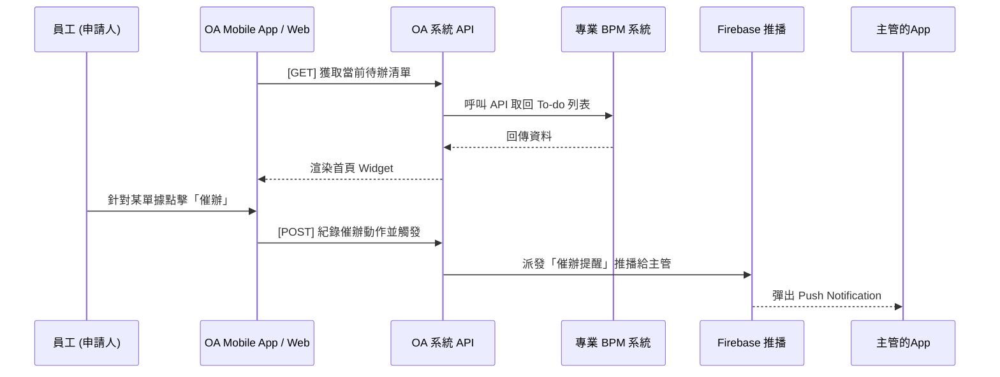
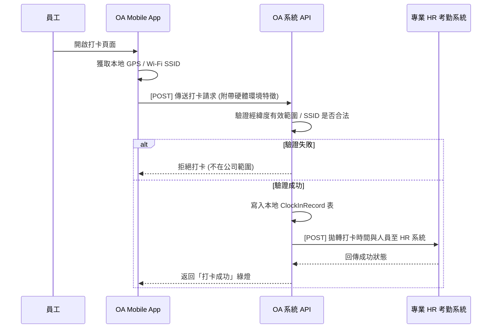
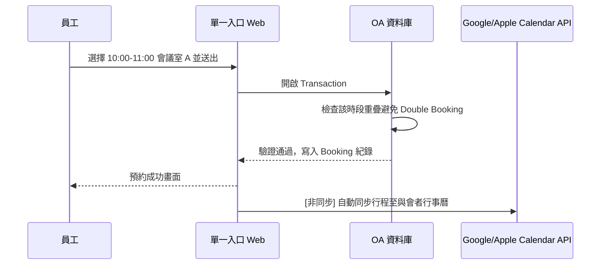

# OA 基本功能模組 - 系統分析與設計文件 (SA)

本文件依據「OA 系統規劃書」中定義的核心與基礎模組，進一步展開 **運作機制**、**作業流程** 與 **應用層資料模型 (Models)** 的設計方案。

---

## 1. 電子簽核流程整合 (BPM Integration)

### 1.1 運作機制
本系統作為 BPM 的外圍「警報器」與「單一入口匯總表」。
* **同步策略與快取機制**：本系統的 API 定期 (或透過 BPM Webhook) 獲取使用者的「待辦數字」。為避免頻繁撈取造成效能瓶頸，查證權限的過程與結果將大量結合 Redis 快取，並搭配 JWT 內的特徵進行判斷。
* **行動催辦 (事件驅動 EDA)**：員工在 App 可點選「發送催辦」，動作將直接寫入內部 Message Queue。系統再非同步派發 Firebase 推播並呼叫專業 BPM API，大幅增加防抖與維運容錯韌性。

### 1.2 主要流程 (待辦同步與催辦)


### 1.3 應用層 Model 設計概念
（作為前端快速展示的快取表或紀錄表，不儲存單據細節）
```typescript
model BpmTaskCache {
  id              String   @id @default(uuid())
  employeeId      String   // 對應員工
  externalTaskId  String   // 對應專業 BPM 的 Task ID
  title           String   // 表單主旨
  systemSource    String   // 來源系統 (例: Flowring BPM)
  status          String   // PENDING / READ
  createdAt       DateTime @default(now())
}

model PokeRecord {
  id              String   @id @default(uuid())
  fromEmployeeId  String   // 催辦人
  toEmployeeId    String   // 被催辦的主管
  externalTaskId  String   // 關聯的表單 ID
  pokedAt         DateTime @default(now())
}
```

---

## 2. 差勤管理整合 (Attendance Integration)

### 2.1 運作機制
本系統為純粹的「打卡終端採集器」，並導入非同步事件驅動架構 (EDA)。
* **防弊與離線機制**：Web 端負責 IP 驗證；Mobile App 端除蒐集 GPS 與 Wi-Fi SSID 外，進階加入反制假定位與設備 Root 偵測。若於廠區死角斷網，App 將以裝置內預埋的 RSA 私鑰進行本地時間戳記簽章暫存，聯網時自動安全回傳。
* **EDA 拋轉與最終一致性**：系統初步驗證打卡環境通過後，即將 `ClockInEvent` 發佈入 Message Queue 中，秒回員工打卡成功。後台 Worker 再從 Queue 取出資料，透過 Retry 機制穩妥地將考勤紀錄倒入 HR 系統，確保高併發時不卡死。

### 2.2 主要流程 (App 打卡與拋轉)


### 2.3 應用層 Model 設計概念
```typescript
model ClockInRecord {
  id            String   @id @default(uuid())
  employeeId    String
  clockType     String   // 'WEB' | 'APP'
  deviceIp      String?
  gpsLatitude   Float?
  gpsLongitude  Float?
  wifiSsid      String?
  isVerified    Boolean  // 環境條件是否驗證通過
  syncStatus    String   // 'PENDING' | 'SYNCED' | 'FAILED' (若拋轉失敗排程可重試)
  createdAt     DateTime @default(now())
}
```

---

## 3. 企業公告與公佈欄 (Bulletin Board)

### 3.1 運作機制
由 HR 或系統管理員發布不同層級別的公告。對於「誰能看見哪些公告」，本系統不再做強關聯判斷，而是交由本框架的**「全域資料可見度與存取控制引擎 (Policy Engine)」**進行查核。只要使用者具權限看到該公告，單一入口就會顯示。若公告設有 `isMustRead`，系統會獨立記錄該名使用者的已讀狀況供統計追蹤。

### 3.2 應用層 Model 設計 (低業務耦合)
```typescript
model Announcement {
  id            String   @id @default(uuid())
  title         String
  content       String   @db.Text
  authorId      String
  isMustRead    Boolean  @default(false)
  publishedAt   DateTime @default(now())
  expiredAt     DateTime?
  // 權限判定交給獨立的 AccessPolicy Engine 取代高耦合欄位
  readLogs      AnnouncementReadLog[]
}

model AnnouncementReadLog {
  id             String   @id @default(uuid())
  announcementId String
  employeeId     String
  readAt         DateTime @default(now())
}
```

---

## 4. 會議室與公務資源預約 (Resource Booking)

### 4.1 運作機制
提供時間軸的視覺化資源狀態。為防止在預約瞬間被其他人搶走，預約時需實作資料庫的鎖機制 (Lock) 或事務 (Transaction)。預約成功後，由系統非同步發送 iCal 檔案給與會者或打 API 同步。

### 4.2 主要流程 


### 4.3 應用層 Model 設計概念
```typescript
enum ResourceType {
  MEETING_ROOM
  COMPANY_CAR
  EQUIPMENT
}

model Resource {
  id          String   @id @default(uuid())
  name        String
  type        ResourceType
  capacity    Int?
  isActive    Boolean  @default(true)
  bookings    ResourceBooking[]
}

model ResourceBooking {
  id             String   @id @default(uuid())
  resourceId     String
  organizerId    String   // 預約者
  title          String
  startTime      DateTime
  endTime        DateTime
  participants   String[] // 與會者 ID 陣列
  createdAt      DateTime @default(now())
}
```

---

## 5. 通訊錄與跨模組職務代理 (Directory & Delegation)

### 5.1 運作機制
讀取組織架構建立樹狀企業目錄。職務代理並非獨立的系統，而是影響「單一入口權限」與「審核通知」的關鍵標記。設定職務代理後，該代理人在期間內可擁有委託人的 Dashboard 與簽核權限。

### 5.2 應用層 Model 設計概念
```typescript
model EmployeeProfile {
  id             String   @id @default(uuid())
  employeeId     String   @unique
  fullName       String
  email          String   @unique
  phoneExtension String?
  departmentId   String
  managerId      String?  // 直屬主管
}

model Delegation {
  id             String   @id @default(uuid())
  delegatorId    String   // 請假人 (委託人)
  delegateeId    String   // 被託付的代理人
  startTime      DateTime
  endTime        DateTime
  isActive       Boolean  @default(true)
}
```

---

## 6. 文件與企業知識管理 (Document Management)

### 6.1 運作機制
檔案實體存放在 AWS S3 或自建的 MinIO 系統之中，資料庫僅記錄「檔名、路徑與檔案樹(Folder)」。本模組不主動驗證「唯讀」、「可下載」、「可編輯」身分；而是在下載檔案 API 時向「全域資料可見度引擎 (Policy Engine)」查證，確認後才給予帶有时效的 Pre-signed URL (如 S3 授權下載網址)。

### 6.2 應用層 Model 設計 (低業務耦合)
```typescript
model DocumentItem {
  id           String   @id @default(uuid())
  name         String
  type         String   // 'FOLDER' | 'FILE'
  parentId     String?  // 指向 FOLDER ID，實作樹狀目錄
  s3ObjectKey  String?  // 實體檔案路徑
  sizeBytes    BigInt?
  ownerId      String   // 上傳者或管理員
  
  // 權限判定由全域策略引擎負責，不再寫死 readRoles / editRoles 陣列
  
  createdAt    DateTime @default(now())
  updatedAt    DateTime @updatedAt
}
```
