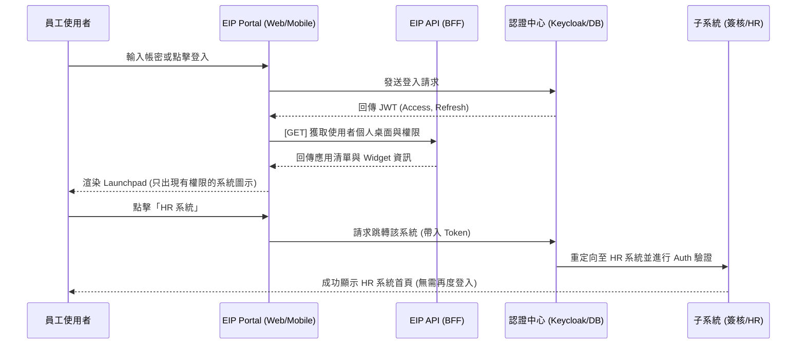

# 單一入口 (EIP Portal) 系統分析 (SA) 文件

## 1. 模組概述 (Module Overview)
「單一入口 (EIP Portal)」作為整個企業 OA 系統的第一道防線與中樞樞紐。其主要目的是讓各級員工、約聘人員甚至外部訪客，只需透過單一網址進行一次性登入 (Single Sign-On)，即可根據其所綁定的角色與權限，展開個人的數位辦公桌面 (Launchpad)，並無縫跳轉至授權的子系統 (如簽核、人資、ERP等)。

---

## 2. 模組拆解與功能清單 (Sub-Modules Breakdown)

本系統將拆分為以下四個核心子模組：

### 2.1 認證與身分模組 (Authentication Identity Module)
負責處理所有進入系統前的身分驗證。
* **標準帳密登入**：串接 AD/LDAP 或內部帳號庫。
* **無密碼登入 (Passwordless)**：
  * **OTP/Magic Link**：透過 Email、SMS 發送一次性密碼或登入連結。
  * **QR Code 掃碼登入**：Mobile App 掃描 Web Portal QR Code 授權登入。
  * **設備綁定**：Mobile 端產生的 UUID 自動兌換訪客 Token。
* **多因素認證 (MFA)**：針對高權限角色（如管理員、高階主管）強制啟用 MFA（如 Google Authenticator / 簡訊驗證）。
* **Token 管理**：簽發與更新 JWT (Access Token & Refresh Token)，並處理 Token 的撤銷。

### 2.2 權限與組織架構模組 (IAM & Org Module)
定義「誰」可以看見「什麼」。
* **組織樹維護**：支援部門層級的建立、修改與停用，對應企業真實的 HR 階層。
* **角色與身分組 (RBAC)**：不僅依賴職稱，可設定如「專案小組」、「外部稽核」、「臨時訪客」等多維度角色。
* **系統微粒存取控制 (ABAC)**：不僅能控制能否進入「簽核系統」，還能把控該角色在 Portal 上能看見的 Widget 儀表板資料（如：待辦事項清單預覽）。

### 2.3 啟動台模組 (Launchpad & Dashboard Module)
使用者登入後看見的第一個畫面（Web 桌面 / Mobile 儀表板）。
* **動態應用程式列表**：拉取 API 後，僅渲染該帳號具備權限的子系統圖示 (Grid / List)。
* **客製化桌面**：允許使用者自行釘選 (Pin)、拖曳排序常用的系統入口。
* **整合即時資訊 Widget**：
  * 「待辦中心」：跨系統匯總的待簽核數量。
  * 「推播與公告通知中心」：接收由 Firebase 派發的全局通知。

### 2.4 跳轉與網關模組 (Redirection & Gateway)
點擊系統圖示後的核心邏輯，確保安全性與無縫體驗。
* **SSO OIDC / SAML 跳轉**：若子系統支援現代協定，則帶入對應的授權碼並 Redirection。
* **Token 交換 (Token Exchange)**：若需要不同權限的子系統 API，透過 BFF 層做 Token 換發。
* **Legacy 系統反向代理 (Reverse Proxy Proxy)**：針對老舊 ASP/JSP 系統，EIP 後端協助呼叫登入，將 session cookie 注入後再導向，實現「免二次輸入密碼」。

---

## 3. 核心運作流程 (Workflows)

### SSO 登入與跳轉子系統流程

---

## 4. API 設計概覽 (API Design Overview)

以 RESTful 標準加上 JWT Authorization Bearer 驗證：

| Endpoint | Method | 負責模組 | 說明 |
|----------|--------|----------|------|
| `/api/v1/auth/login` | POST | 認證中心 | Email/Password 登入，取得 JWT |
| `/api/v1/auth/guest-login` | POST | 認證中心 | 無密碼身分登入 (透過 UUID/設備 ID) |
| `/api/v1/users/me` | GET | 權限與組織 | 取得個人基本資料、隸屬部門、角色清單 |
| `/api/v1/portal/apps` | GET | 啟動台 | 取得授權的系統/應用程式清單與其 Icon 網址 |
| `/api/v1/portal/widgets`| GET | 啟動台 | 取得整合性 Widget 數據 (如待辦數量) |
| `/api/v1/redirect/{app_id}`| GET | 跳轉網關 | 請求跳轉特定系統，後端處理換發或生成憑證後回傳重定向 URL |

---

## 5. 資料庫模型概覽 (Database Schema Overview)

核心資料表 (Tables) 將圍繞在 RBAC 的設計上：

1. **`users`**：存放員工基本資訊，包含 `employee_id`, `email`, `auth_provider` (區分本機或 AD 等), `device_uuid` (用於訪客)。
2. **`departments`**：組織樹狀結構，包含 `parent_id` 支援多階層。
3. **`roles`**：定義如 `admin`, `manager`, `guest`, `employee`。
4. **`user_roles`**：關聯 `users` 與 `roles` (多對多)。
5. **`applications`**：子系統註冊表。欄位包含 `app_name`, `icon_url`, `entry_url`, `auth_type` (OIDC/FormAuth/Proxy)。
6. **`AccessPolicy` (全域獨立引擎)**：不再使用傳統的 `role_permissions`，而是交由「全域資料可見度與存取控制引擎」集中判斷哪些角色/部門可以看見哪些 `applications` (子系統入口) 或是特定的 UI Widget。

---

## 6. 前端 (Web/Mobile) 實作重點

* **全局狀態管理**：使用 Zustand 或 Redux Toolkit 儲存使用者的 Profile 與 Permissions。
* **Route Guards (路由守衛)**：若使用者透過 URL 直連某個功能，前端需先行攔截並確認 Global State 中的權限陣列是否包含該路由，若無則導至 403 畫面。
* **Storage**：考量到跳轉流程，JWT Token 應存放於 `HttpOnly Cookies`（防止 XSS 攻擊），若於 App 端則使用 `Secure Storage` (如 expo-secure-store) 進行加密存放。
